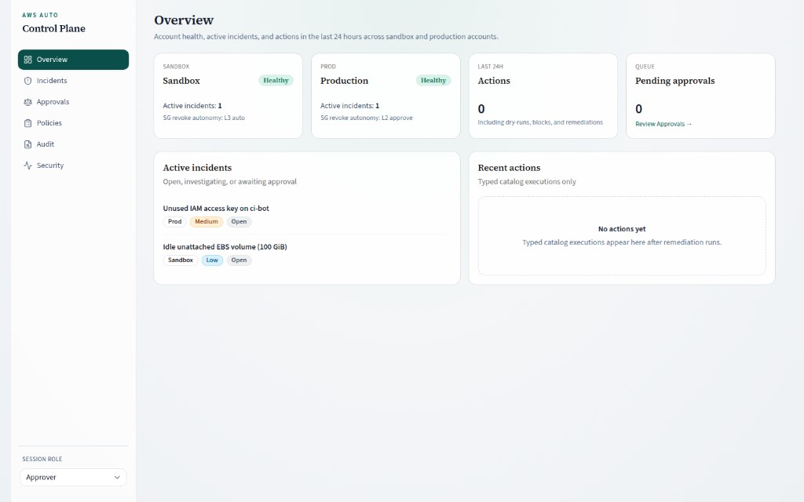

# AWS Auto Control Plane

A control plane that watches AWS accounts, explains what it finds, and either fixes the problem or asks a person to approve the fix. One dashboard covers account health, open incidents, the approval queue, policy, and an audit trail of every change.



This repository is the first working slice of that platform: a world-open SSH security group, plus companion findings for an unused IAM key and an idle EBS volume. The same UI runs against seeded demo data or live AWS APIs. The mode is an environment variable.

## Use case

Security, reliability, and cost signals already exist in CloudTrail, AWS Config, GuardDuty, Security Hub, and Cost Explorer. They do not share one place to explain a finding, decide how much autonomy it deserves, apply a reversible fix, and keep the evidence.

This control plane is that place.

A typical path looks like this. Someone opens port 22 to `0.0.0.0/0` on a security group. A detector flags it. The agent explains the exposure and proposes revoking that one rule. Policy decides the autonomy: sandbox remediates immediately, production waits for an approver. The executor removes the rule, checks that it is gone, and stores the before and after state so the change can be rolled back.

The same pattern is meant to cover later domains — IAM, idle resources, scaling, drift, incident response — without giving a model unrestricted AWS credentials.

## Design principles

1. **The model reasons; tools act.** Proposed work is a typed action from a fixed catalog (`revoke_sg_rule`, `deactivate_access_key`). Inputs are schema-checked. The agent does not hold write credentials.
2. **Autonomy is graduated.** Each action type has a level per environment: observe, recommend, approve-then-act, or auto-act.
3. **Reversible changes come first.** Deactivate a key before deleting a user. Revoke one ingress rule before rewriting a security group.
4. **Rules handle the clear cases.** A security group open to the world on port 22 is a detector, not a language-model guess. The model is reserved for explanation, correlation, and ambiguous cases.
5. **Every step is audited.** Events, reasoning, approvals, and actions are stored with before and after state.
6. **Logs and tags are data.** Resource names, principals, and log lines are displayed as evidence. They are not treated as instructions.

## What this slice does

| Area | In this repo |
| --- | --- |
| Accounts | Sandbox and Production, shown side by side |
| Detection | World-open SSH (`tcp/22` from `0.0.0.0/0` or `::/0`) from CloudTrail- or Config-shaped events |
| Companion findings | Unused IAM access key on `ci-bot`; idle unattached EBS volume (100 GiB) |
| Actions | `revoke_sg_rule`, `deactivate_access_key` |
| Policy | Per-action autonomy, dry-run, global kill switch |
| Verification | Confirm the rule is gone (or the key is inactive) after the change |
| Audit | Immutable history with rollback context |
| Modes | Demo (in-memory fixtures) or live (AWS SDK + DynamoDB) |

Later platform work — multi-account ingestion, scaling and drift agents, FinOps, chat, and compliance evidence — follows the same loop. It is not built here yet.

## How a finding moves

```text
Event (CloudTrail / Config / demo)
  -> detector (known pattern?)
  -> incident + evidence + proposed plan
  -> policy (level, dry-run, kill switch)
       L3  execute, verify, record
       L2  approval queue, then execute
       L1  recommend only
       L0  observe only
  -> audit log + dashboard
```

Default autonomy in the seeded policy:

| Action | Sandbox | Production | Why |
| --- | --- | --- | --- |
| Revoke a world-open SSH rule | L3 Auto | L2 Approve | Low risk, reversible, high value |
| Deactivate an unused IAM access key | L1 Recommend | L0 Observe | Still on the trust ladder |

| Level | Name | Behaviour |
| --- | --- | --- |
| L0 | Observe | Detect and report |
| L1 | Recommend | Explain the issue and propose a plan |
| L2 | Approve | Execute after a person approves it in the dashboard |
| L3 | Auto | Execute, verify, and record; reserved for pre-approved playbooks |

Operators, approvers, and admins share the dashboard. **Operator** cannot approve. **Approver** and **Admin** can. The role selector is in the sidebar.

## Dashboard

| Page | What you use it for |
| --- | --- |
| **Overview** | Account health, active incidents, actions in the last 24 hours, pending approvals |
| **Incidents** | Timeline, evidence, and the agent’s proposed plan |
| **Approvals** | Diff, risk, and blast radius; approve or reject |
| **Policies** | Autonomy per action and environment, dry-run, kill switch |
| **Audit** | Before and after state, verification, rollback |
| **Security** | IAM and exposure findings that sit beside the open-SSH path |

## Run locally (demo)

Demo is the default. It needs no AWS credentials.

```bash
cp .env.example .env.local
npm install
npm run dev
```

Open [http://127.0.0.1:43127](http://127.0.0.1:43127).

Inject the open-SSH scenario into both accounts:

```bash
curl -X POST http://127.0.0.1:43127/api/demo \
  -H 'Content-Type: application/json' \
  -d '{"target":"both"}'
```

Sandbox auto-remediates (L3). Production queues an approval (L2). Approve it on **Approvals**, then open **Audit** for the before/after state and rollback.

`target` also accepts `"sandbox"` or `"prod"`.

## Run live

```bash
# .env.local
DEMO_MODE=false
# or: CONTROL_PLANE_MODE=live
AWS_REGION=us-east-1
AWS_ACCESS_KEY_ID=...
AWS_SECRET_ACCESS_KEY=...
# or omit keys and use the default credential chain (profile, instance role)
CONTROL_PLANE_TABLE=aws-auto-control-plane
CONTROL_PLANE_ACCOUNTS='[{"id":"acct-sandbox","name":"Sandbox","env":"sandbox","awsAccountId":"111111111111"},{"id":"acct-prod","name":"Production","env":"prod","awsAccountId":"222222222222"}]'
```

Create a DynamoDB table with partition key `pk` (String) and sort key `sk` (String).

Ingest a CloudTrail, EventBridge, or Config-shaped event:

```bash
curl -X POST http://127.0.0.1:43127/api/ingest \
  -H 'Content-Type: application/json' \
  -d @cloudtrail-authorize-sg.json
```

If required environment variables are missing, the API and UI return a configuration error (HTTP 503) and do not invent AWS results.

Live actions:

| Action | AWS calls |
| --- | --- |
| `revoke_sg_rule` | `EC2:RevokeSecurityGroupIngress`, then `DescribeSecurityGroups` to verify |
| `deactivate_access_key` | `IAM:UpdateAccessKey` with `Status=Inactive` |

## Scripts

| Script | Description |
| --- | --- |
| `npm run dev` | Dev server on port **43127** |
| `npm run build` | Production build |
| `npm run start` | Production server on port **43127** |
| `npm run lint` | ESLint |
